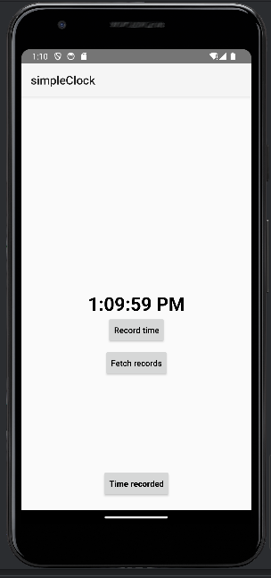
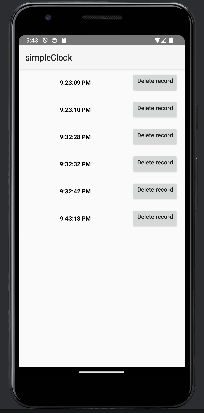
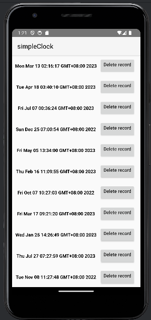

# Simple Clock

* 时间显示方式与手机时间显示方式一致

* 点击Record time以字符串的形式记录当前时间

* 点击 Fetch records从远程读取记录数据（为了方便验证，格式为与Date.toString()一致）

* 点击Time recorded查看记录的时间。(从远程取回的时间记录也在这里查看)

  

  

  * 点击Delete record删除该时间记录